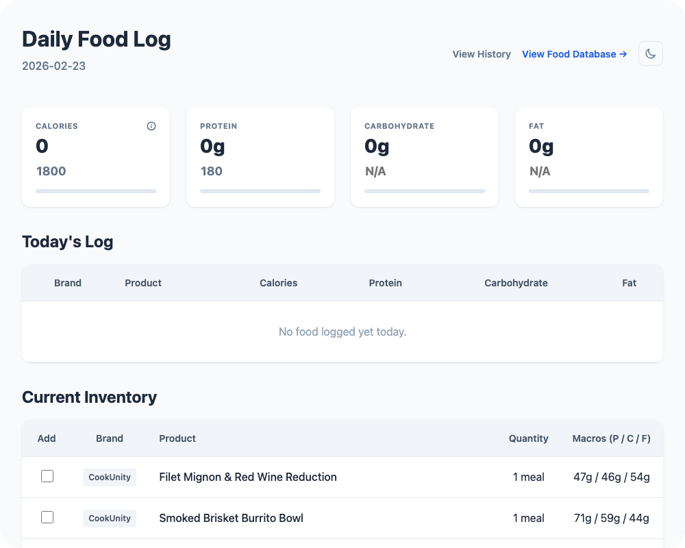

# 🥗 Daily Food Log (DFL)

> **Daily Food Log (or DFL)** is a simple, lightweight dashboard for tracking macronutrients and managing food inventory. It provides a clean and direct view of daily nutrition without the complexity of traditional logging apps.



---

## 🤖 The Gemini Workflow

DFL is designed for an **AI-first workflow**. Instead of manual data entry, I use the **Gemini CLI** to manage my nutritional data:

*   **Intelligent Logging**: I simply tell Gemini what I ate (e.g., *"I just had the CookUnity Meatloaf but skipped the sauce"*).
*   **Autonomous Calculation**: Gemini calculates the specific nutritional adjustments and updates the JSON source files in `data/` and `logs/`.
*   **Automated Delivery**: Upon pushing changes, a GitHub Action regenerates the static site and deploys the update to GitHub Pages.

---

## ✨ Key Features

*   **⚡️ Dynamic Projections**: Select items from your inventory to see a live simulation of how they will impact your daily totals and goals before you eat.
*   **⚖️ Cut & Bulk Phases**: Toggle between fitness strategies. The dashboard dynamically adjusts its visual logic and color-coding to reflect whether you are targeting a deficit or a surplus.
*   **📦 Inventory Management**: Keep track of exactly what meals and snacks you have on hand in your pantry or fridge.
*   **🎯 Goal & Threshold Tracking**: Set personalized targets for calories and protein, with built-in thresholds for "Target" and "Maintenance" levels.
*   **📈 Historical Analysis**: Browse past daily logs with collapsible detailed breakdowns to compare your progress over time.
*   **🔍 Searchable Food Library**: A global, sortable database of every food item, brand, and ingredient in your collection.

---

## 🛠 Technology Stack

*   **AI Engine**: [Google Gemini CLI](https://github.com/google/gemini-cli) — Powering the autonomous logging and data management workflow.
*   **Core**: Python 3.12 managed by `uv`.
*   **Frontend**: Dependency-free HTML5, CSS3 (Vanilla), and ES6+ JavaScript.
*   **CI/CD**: GitHub Actions & GitHub Pages.

---

## 🚀 Getting Started

### Prerequisites
Before you begin, ensure you have the following installed:
*   [Python 3.12+](https://www.python.org/)
*   [uv](https://github.com/astral-sh/uv) (Python package manager)
*   [Gemini CLI](https://github.com/google/gemini-cli) (For autonomous data management)

### Installation
Sync the environment using `uv`:
```bash
uv sync
```

### Usage
To manage your data:
1. Open the **Gemini CLI** within this repository.
2. Tell Gemini what you ate or what inventory you want to add.
3. Gemini will autonomously handle the JSON updates and nutritional math for you.

### Updating the Dashboard
The dashboard can be updated in two ways:
1.  **Manual**: Run `uv run generate.py all` to rebuild the site locally.
2.  **Automatic**: Simply `git push` your updated JSON files. A GitHub Action will automatically rebuild and deploy the site to GitHub Pages.

### Local Viewing
Simply open `index.html` in any modern web browser.
